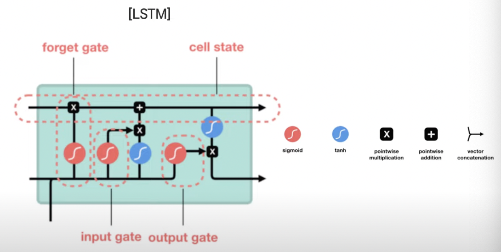
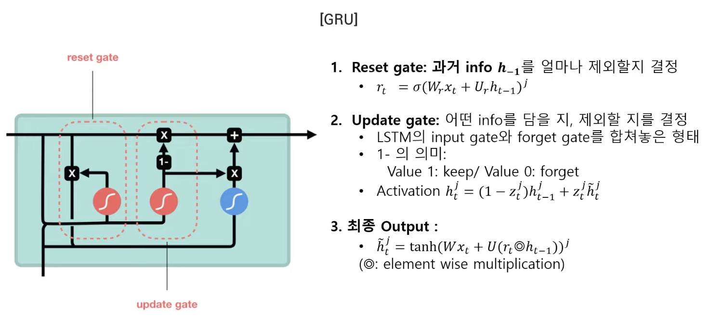

# Gated RNN

작성일: April 23, 2023
작성한 사람: 양원희
태그: AI

RNN: Recurrent Neural Network for sequences

현재 시점의 input과 이전의 hidden state들을 합쳐 최종 input을 만듦.

🌟 현재 시점의 input과 바로 이전만의 input을 합쳐서 input을 만드는 것이 아님.

매 timestamp마다 이전의 정보 + 새로운 input 정보.

중요한 정보를 취사 선택하며, hidden layer는 input과 output 사이의 barrier 역할을 함. output은 네트워크에 의해서 결정됨. 만약 중간 layer에 input이 들어가지 않더라도 hidden layer는 매 timestamp마다 바뀜. 

backpropagation에서는 일반적인 NN과 달리 weight, synapse 0, 1, h를 반복해서 사용함.

$$
h_t = f(h_{t-1}, x_t), 
h_t = g(Wx_t + UH_{t-1})
$$

여기서 f는 RNN의 함수.

g함수는 smooth, bounded function. (logistic sigmoid, tanh function)

### RNN의 단점 및 해결책.

- back propagation할 때의 Gradient vanishing problem. Long-term dependency를 capture하는 것이 어려움.
- 해결책: more sophisticated activation function. (Gated Recurrent Neural network)
- Gate: 선택적으로 정보를 추가하거나 제외시키게 하는 장치.
- Ex. LSTM, GRU

cell state: 정보 전달 highway, 게이트들에 의해 어떤 정보가 허용되는지 결정됨.

forget gate: 정보를 keep / forget할지 결정.

input gate: 새로운 cell value를 위해 가해지는 input을 조절.

output gate: 다음 hidden state(memory)를 결정.

<aside>
💡 원문 및 유튜브 링크: [https://www.youtube.com/watch?v=5Ar1aN9gceg](https://www.youtube.com/watch?v=5Ar1aN9gceg)

[[paper]LSTM_GRU.pdf](README/paperLSTM_GRU.pdf)

</aside>